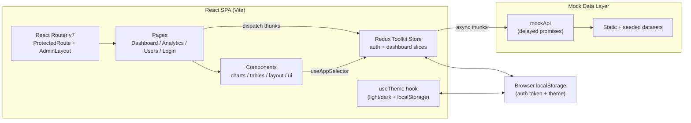

# Analytics Dashboard — Step-by-Step Build Guide

> **Archived: original build playbook.** This document is the original roadmap used to build the Analytics Dashboard project. The codebase may have evolved since this guide was written; for current setup, architecture, and deployment notes, see [../README.md](../README.md).

---

> **Project Summary:** Analytics Dashboard is a modern admin dashboard application that visualizes business KPIs, revenue/expense trends, traffic sources, and user data. It features a Zod-validated login flow, token-based session persistence, protected routes, centralized state management with Redux Toolkit, interactive charts with Recharts, and a data table with search, sorting, and pagination. All data is served from a delayed mock API layer that emulates a real backend. The application is configured for production with light/dark theming, accessibility-first (a11y) components, unit/component tests, and static analysis.

Each step below is a self-contained prompt. Execute them in order.

Stack: React 19, TypeScript 5.9, Vite 7, Redux Toolkit, React Router v7, React Hook Form, Zod, Tailwind CSS 3, shadcn/ui (Radix UI), Recharts 3, lucide-react, Vitest, Testing Library, ESLint.

---

## Table of Contents

**PHASE 1 — Project Foundation**

- STEP 1 — Project Scaffolding & Dependency Setup
- STEP 2 — Tailwind, Path Aliases & Theme Tokens

**PHASE 2 — State & Data Layer**

- STEP 3 — Mock Data & Simulated API
- STEP 4 — Redux Store, Slices & Typed Hooks

**PHASE 3 — UI Primitives, Auth & Theming**

- STEP 5 — shadcn/ui Primitive Components
- STEP 6 — Authentication (Slice, Login Page, Protected Route)
- STEP 7 — Theme Hook & Dark Mode Toggle

**PHASE 4 — Layout, Pages & Visualizations**

- STEP 8 — Application Shell (AdminLayout, Sidebar, Header, Footer)
- STEP 9 — Chart Components (Revenue, Traffic, Conversion)
- STEP 10 — DataTable (Search, Sort, Pagination)
- STEP 11 — Dashboard, Analytics & Users Pages

**PHASE 5 — Quality & Deploy**

- STEP 12 — ESLint Flat Config
- STEP 13 — Vitest Test Suite
- STEP 14 — Netlify Deployment & Production Build

**Appendices**

- Appendix A — Shared Utilities & Formatters
- Appendix B — Domain Type Definitions
- Appendix C — Common Pitfalls
- Appendix D — Pre-flight Checklist

---

## Global Build Rules (apply to EVERY step)

- **No git operations.** No step in this guide runs a `git` command. Version control (commit, branch, push) is handled manually by the user.
- Do not install unapproved packages. Only add the dependencies explicitly listed in the relevant step.
- Do not start long-running processes (dev server, watch) unless requested.
- Treat every step as self-contained; provide all required context within the step.
- Code must be clean, readable, and type-safe. Use English, descriptive, camelCase naming.
- Security, accessibility (a11y), and performance are always priorities.
- Follow the DRY principle; extract repeated logic into reusable helpers.

---

## Architecture at a Glance



The application is a single-page client (SPA); there is no real server. The `mockApi` layer emulates the behavior of a real REST backend with `setTimeout`-based delays. The Redux store is split into two slices: `auth` (session) and `dashboard` (KPIs, charts, tables). The session token and theme preference are persisted via `localStorage`.

---

# PHASE 1 — PROJECT FOUNDATION

---

## STEP 1 — Project Scaffolding & Dependency Setup

**Goal:** Set up the Vite + React + TypeScript skeleton and add all runtime/development dependencies.

**Files/folders:**

- `package.json`, `tsconfig.json`, `tsconfig.app.json`, `tsconfig.node.json`
- `vite.config.ts`, `index.html`
- `src/main.tsx`, `src/App.tsx`, `src/vite-env.d.ts`

**Dependencies:**

```bash
# Runtime
npm install react react-dom react-router-dom @reduxjs/toolkit react-redux \
  react-hook-form @hookform/resolvers zod recharts lucide-react \
  class-variance-authority clsx tailwind-merge \
  @radix-ui/react-avatar @radix-ui/react-dialog @radix-ui/react-dropdown-menu \
  @radix-ui/react-label @radix-ui/react-separator @radix-ui/react-slot

# Dev
npm install -D vite @vitejs/plugin-react typescript @types/react @types/react-dom \
  @types/node tailwindcss postcss autoprefixer
```

**Implementation notes:**

- `package.json` script set: `dev` (`vite`), `build` (`tsc -b && vite build`), `preview` (`vite preview`).
- `tsconfig.app.json` is configured with strict settings: `strict`, `noUnusedLocals`, `noUnusedParameters`, `noFallthroughCasesInSwitch`, `noUncheckedIndexedAccess`. Define the `@/*` -> `./src/*` mapping via `paths`.
- `src/main.tsx` wraps the app in `Provider` (Redux store) and `StrictMode`.

```tsx
// src/main.tsx
createRoot(document.getElementById("root")!).render(
  <StrictMode>
    <Provider store={store}>
      <App />
    </Provider>
  </StrictMode>
);
```

**Acceptance checklist:**

- [ ] `npm run dev` runs without errors and serves an empty page.
- [ ] The `@/` alias resolves on both the Vite and TypeScript sides.

---

## STEP 2 — Tailwind, Path Aliases & Theme Tokens

**Goal:** Install Tailwind CSS, define CSS-variable-based theme tokens (light + dark), and wire up the `@` alias.

**Files/folders:**

- `tailwind.config.ts`, `postcss.config.js`
- `src/index.css`
- `vite.config.ts` (alias)

**Implementation notes:**

- In `tailwind.config.ts`, set `darkMode: "class"` and `content: ["./index.html", "./src/**/*.{ts,tsx}"]`. Extend colors with `hsl(var(--token))` references (`primary`, `secondary`, `muted`, `accent`, `destructive`, `border`, `card`, `popover`, etc.).
- In `src/index.css`, the `:root` (light) and `.dark` (dark) blocks define the same token set with different HSL values. This is the foundation for the theme switching in STEP 7.

```css
@layer base {
  :root {
    --background: 0 0% 100%;
    --foreground: 222.2 84% 4.9%;
    --primary: 221.2 83.2% 53.3%;
    /* ...other tokens... */
  }
  .dark {
    --background: 222.2 84% 4.9%;
    --foreground: 210 40% 98%;
    --primary: 217.2 91.2% 59.8%;
    /* ...other tokens... */
  }
  * { @apply border-border; }
  body { @apply bg-background text-foreground; }
}
```

- In `vite.config.ts`, wire `@` -> `path.resolve(__dirname, "./src")` via `resolve.alias`.

**Acceptance checklist:**

- [ ] Tailwind utility classes are compiled and applied.
- [ ] Colors change when the `dark` class is added to the `<html>` element.

---

# PHASE 2 — STATE & DATA LAYER

---

## STEP 3 — Mock Data & Simulated API

**Goal:** Create all domain types, static datasets, and a delayed API layer that emulates a real REST backend.

**Files/folders:**

- `src/mocks/data.ts`
- `src/mocks/api.ts`

**Implementation notes:**

- `data.ts` exports the `User`, `RevenueData`, `TrafficData`, `ConversionData`, `StatsOverview`, and `RecentOrder` interfaces along with their corresponding sample datasets (see Appendix B).
- Traffic data must be **deterministic**: use a seeded PRNG (mulberry32) instead of `Math.random()`. This produces the same data on every reload and makes the data testable.

```ts
function createSeededRandom(seed: number): () => number {
  let state = seed >>> 0;
  return () => {
    state = (state + 0x6d2b79f5) >>> 0;
    let t = Math.imul(state ^ (state >>> 15), 1 | state);
    t = (t + Math.imul(t ^ (t >>> 7), 61 | t)) ^ t;
    return ((t ^ (t >>> 14)) >>> 0) / 4294967296;
  };
}
const seededRandom = createSeededRandom(20260101);
```

- `api.ts` exposes a `mockApi` object that returns a `Promise` for each endpoint via a `delay(ms)` helper. `login` validates fixed credentials (`admin@dashboard.com` / `admin123`) and throws an `Error` if invalid.

```ts
const delay = (ms: number) => new Promise((resolve) => setTimeout(resolve, ms));

export const mockApi = {
  login: async (credentials) => {
    await delay(800);
    if (credentials.email === "admin@dashboard.com" && credentials.password === "admin123") {
      return { token: "mock-jwt-token-abc123", user: { name: "Admin User", email: credentials.email, role: "admin", avatar: "" } };
    }
    throw new Error("Invalid email or password");
  },
  getStats: async () => { await delay(400); return statsOverview; },
  // getRevenue, getTraffic, getConversions, getUsers, getRecentOrders ...
};
```

**Acceptance checklist:**

- [ ] All types and datasets can be imported from a single place.
- [ ] `mockApi` calls resolve/reject with realistic delays.

---

## STEP 4 — Redux Store, Slices & Typed Hooks

**Goal:** Set up centralized state management with feature-based slices and type-safe hooks.

**Files/folders:**

- `src/app/store.ts`, `src/app/hooks.ts`
- `src/features/auth/authSlice.ts`
- `src/features/dashboard/dashboardSlice.ts`

**Implementation notes:**

- `store.ts` combines the `auth` and `dashboard` reducers via `configureStore` and exports the `RootState` / `AppDispatch` types.
- `hooks.ts` produces `useAppDispatch` / `useAppSelector` using `useDispatch.withTypes` and `useSelector.withTypes`. Never use the raw hooks in components.

```ts
export const useAppDispatch = useDispatch.withTypes<AppDispatch>();
export const useAppSelector = useSelector.withTypes<RootState>();
```

- `dashboardSlice` includes the `fetchDashboardData` (fetches stats + revenue + traffic + conversions + recentOrders in parallel via `Promise.all`) and `fetchUsers` async thunks. `extraReducers` handles the `pending/fulfilled/rejected` states for each thunk.

**Acceptance checklist:**

- [ ] The store is initialized with the `auth` and `dashboard` slices.
- [ ] `useAppSelector` provides full type inference.

---

# PHASE 3 — UI PRIMITIVES, AUTH & THEMING

---

## STEP 5 — shadcn/ui Primitive Components

**Goal:** Add accessible, reusable base components built on Radix UI.

**Files/folders:**

- `src/components/ui/` — `button.tsx`, `input.tsx`, `label.tsx`, `card.tsx`, `badge.tsx`, `table.tsx`, `avatar.tsx`, `dropdown-menu.tsx`, `separator.tsx`, `sheet.tsx`
- `src/lib/utils.ts` — the `cn()` helper (see Appendix A)

**Implementation notes:**

- Each primitive merges classes with `cn()` (clsx + tailwind-merge); variants are defined with `class-variance-authority` (cva).
- `badge.tsx` includes `success` and `warning` variants in addition to the standard ones, with dark mode classes added:

```ts
success: "border-transparent bg-emerald-100 text-emerald-800 dark:bg-emerald-500/20 dark:text-emerald-300",
warning: "border-transparent bg-amber-100 text-amber-800 dark:bg-amber-500/20 dark:text-amber-300",
```

- `input.tsx` must use a `type` alias instead of an empty interface (`export type InputProps = React.InputHTMLAttributes<HTMLInputElement>;`). This avoids violating ESLint's `no-empty-object-type` rule.

**Acceptance checklist:**

- [ ] All primitives are keyboard accessible and support `forwardRef`.
- [ ] Variants are readable in both light and dark themes.

---

## STEP 6 — Authentication (Slice, Login Page, Protected Route)

**Goal:** Set up a Zod-validated login form, token persistence, and protected route logic.

**Files/folders:**

- `src/features/auth/authSlice.ts`
- `src/features/auth/LoginPage.tsx`
- `src/features/auth/ProtectedRoute.tsx`

**Implementation notes:**

- `authSlice` hydrates its initial state from `localStorage` (`auth_token`, `auth_user`). If the `login` thunk succeeds, the token/user are written to `localStorage`; `logout` clears them. The `clearError` reducer resets the error message.
- `LoginPage` works with `react-hook-form` + `zodResolver`. Schema: a valid email and a password of at least 6 characters. Demo credentials are prefilled as `defaultValues`. If a token exists, it redirects to `/` via `useEffect`. For accessibility, `aria-invalid` and error messages are used.

```ts
const loginSchema = z.object({
  email: z.string().email("Please enter a valid email address"),
  password: z.string().min(6, "Password must be at least 6 characters"),
});
```

- `ProtectedRoute` renders `<Navigate to="/login" replace />` if `auth.token` is missing, and `<Outlet />` if present.

**Security & a11y:**

- The token is kept in `localStorage` (for demo purposes). In real production, an HttpOnly cookie should be preferred — this is noted as a pitfall in Appendix C.
- Form fields are associated with a `Label`; error states are announced to screen readers via `aria-invalid`.

**Acceptance checklist:**

- [ ] An error message appears for invalid credentials; valid credentials redirect to the dashboard.
- [ ] The session persists across page reloads.
- [ ] Accessing a protected route without a token redirects to `/login`.

---

## STEP 7 — Theme Hook & Dark Mode Toggle

**Goal:** Set up a theme system that detects system preference, persists in `localStorage`, and is flash-free (FOUC-free) on reload.

**Files/folders:**

- `src/hooks/useTheme.ts`
- `src/components/layout/ThemeToggle.tsx`
- `index.html` (FOUC prevention script)

**Implementation notes:**

- `useTheme` determines the initial theme via `localStorage` or `prefers-color-scheme`, applies the `dark` class to `documentElement`, and saves the preference.

```ts
useEffect(() => {
  const root = document.documentElement;
  root.classList.toggle("dark", theme === "dark");
  localStorage.setItem("theme", theme);
}, [theme]);
```

- A small inline script that runs before React paints is added to `index.html` to prevent flash:

```html
<script>
  (function () {
    try {
      var t = localStorage.getItem("theme");
      var prefersDark = window.matchMedia("(prefers-color-scheme: dark)").matches;
      if (t === "dark" || (!t && prefersDark)) document.documentElement.classList.add("dark");
    } catch (e) {}
  })();
</script>
```

- `ThemeToggle` is placed inside `Header`, is accessible via `aria-label`, and shows a `Sun`/`Moon` icon depending on the light/dark state.

**Acceptance checklist:**

- [ ] The toggle switches the theme instantly and the preference persists across reloads.
- [ ] No theme flash (FOUC) occurs on first load.

---

# PHASE 4 — LAYOUT, PAGES & VISUALIZATIONS

---

## STEP 8 — Application Shell (AdminLayout, Sidebar, Header, Footer)

**Goal:** Set up a responsive application shell that wraps the protected routes.

**Files/folders:**

- `src/App.tsx` — route definitions
- `src/components/layout/` — `AdminLayout.tsx`, `Sidebar.tsx`, `Header.tsx`, `Footer.tsx`, `ThemeToggle.tsx`

**Implementation notes:**

- `App.tsx` defines `/login` (public) inside `BrowserRouter` and nested routes (`/`, `/analytics`, `/users`) under `ProtectedRoute > AdminLayout`. Unknown routes redirect to `/`.

```tsx
<Route element={<ProtectedRoute />}>
  <Route element={<AdminLayout />}>
    <Route path="/" element={<DashboardPage />} />
    <Route path="/analytics" element={<AnalyticsPage />} />
    <Route path="/users" element={<UsersPage />} />
  </Route>
</Route>
```

- `AdminLayout` contains a sticky sidebar on wide screens, an `<Outlet />` for the content area, and a `Header`/`Footer`.
- `Sidebar` highlights the active route via `NavLink` and is reused inside a `Sheet` on mobile (it closes the menu via the `onNavigate` prop).
- `Header` hosts the mobile menu trigger, the `ThemeToggle`, and the user `DropdownMenu` (including logout).

**Acceptance checklist:**

- [ ] The persistent sidebar works on desktop and the collapsible `Sheet` works on mobile.
- [ ] Logout clears the session and redirects to `/login`.

---

## STEP 9 — Chart Components (Revenue, Traffic, Conversion)

**Goal:** Create reusable Recharts components fed from the store.

**Files/folders:**

- `src/components/charts/` — `RevenueChart.tsx`, `TrafficChart.tsx`, `ConversionChart.tsx`

**Implementation notes:**

- Each chart reads its own store slice via `useAppSelector`; no prop drilling.
- `RevenueChart` is a gradient-filled `AreaChart` for revenue vs expenses. `TrafficChart` is a `BarChart` for daily visitors. `ConversionChart` is a donut `PieChart` for traffic sources.
- All charts are wrapped in `ResponsiveContainer`, and tooltips are styled with theme tokens (`hsl(var(--background))`, `hsl(var(--border))`). Values are formatted with `formatCurrency` / `formatNumber`.

**Acceptance checklist:**

- [ ] Charts resize responsively to their container.
- [ ] Tooltips and axes are readable in both light and dark themes.

---

## STEP 10 — DataTable (Search, Sort, Pagination)

**Goal:** Set up a performant data table with search, column sorting, and pagination.

**Files/folders:**

- `src/components/tables/DataTable.tsx`

**Implementation notes:**

- Filtering and sorting are computed with `useMemo`; pagination uses a fixed `PAGE_SIZE = 8`. `safeCurrentPage` safely handles cases that exceed the total page count.
- **Critical:** Helper components (e.g., `SortIcon`) must be defined **outside** the main component. Defining a component during render (`react-hooks/static-components`) causes state resets and produces an ESLint error. `SortIcon` is fed via the `activeKey` and `direction` props.

```tsx
function SortIcon({ column, activeKey, direction }: SortIconProps) {
  if (activeKey !== column) return <ArrowUpDown className="ml-1 h-3 w-3" />;
  return direction === "asc" ? <ArrowUp className="ml-1 h-3 w-3" /> : <ArrowDown className="ml-1 h-3 w-3" />;
}
```

- When search or sorting changes, the page returns to 1. A "No users found." row is shown for empty results.

**Acceptance checklist:**

- [ ] Search filters across the name, email, and role fields.
- [ ] Column headers toggle the sort direction; the icon reflects the state.
- [ ] Pagination boundaries are disabled correctly.

---

## STEP 11 — Dashboard, Analytics & Users Pages

**Goal:** Build the three main pages that fetch data via thunks and compose the components.

**Files/folders:**

- `src/features/dashboard/` — `DashboardPage.tsx`, `AnalyticsPage.tsx`, `UsersPage.tsx`

**Implementation notes:**

- **Consistent data fetching:** Each page must not refetch if the data is already loaded. `DashboardPage` uses an `if (!stats)` guard, `AnalyticsPage` uses `if (revenue.length === 0)`, and `UsersPage` uses `if (users.length === 0)`. This avoids unnecessary network calls and unnecessary loading spinners.

```tsx
useEffect(() => {
  if (!stats) dispatch(fetchDashboardData());
}, [dispatch, stats]);
```

- `DashboardPage` has 4 KPI cards (revenue, users, orders, conversion), revenue + traffic charts, and a recent orders table. Positive/negative changes are emphasized with color.
- `AnalyticsPage` has revenue vs expenses, traffic trends, traffic sources (pie), and monthly profit-margin bars.
- `UsersPage` feeds the `DataTable` with the `users` data.

**Acceptance checklist:**

- [ ] Data loads on first entry; navigating between pages does not refetch.
- [ ] A spinner shows while loading, and content shows once data arrives.

---

# PHASE 5 — QUALITY & DEPLOY

---

## STEP 12 — ESLint Flat Config

**Goal:** Set up static analysis with TypeScript, React Hooks, and React Refresh rules.

**Files/folders:**

- `eslint.config.js`
- `package.json` (`lint` script)

**Dependencies:**

```bash
npm install -D eslint @eslint/js globals typescript-eslint \
  eslint-plugin-react-hooks eslint-plugin-react-refresh
```

**Implementation notes:**

- The flat config (`eslint.config.js`) is set up with `tseslint.config(...)`; `dist`, `coverage`, and `node_modules` are ignored.
- For `src/components/ui/**`, `react-refresh/only-export-components` is disabled (because shadcn/ui primitives export variants alongside components).
- For test files, `globals.node` is added.
- `package.json`: `"lint": "eslint ."`.

**Acceptance checklist:**

- [ ] `npm run lint` passes with 0 errors and 0 warnings.

---

## STEP 13 — Vitest Test Suite

**Goal:** Set up unit and component tests in a jsdom environment.

**Files/folders:**

- `vite.config.ts` (test block)
- `src/test/setup.ts`
- `src/lib/utils.test.ts`, `src/features/auth/authSlice.test.ts`, `src/components/tables/DataTable.test.tsx`

**Dependencies:**

```bash
npm install -D vitest jsdom @testing-library/react @testing-library/jest-dom \
  @testing-library/user-event @vitest/coverage-v8
```

**Implementation notes:**

- `vite.config.ts` starts with `/// <reference types="vitest/config" />` and adds `test: { globals: true, environment: "jsdom", setupFiles: ["./src/test/setup.ts"], css: true }`.
- `setup.ts` imports the `@testing-library/jest-dom/vitest` matchers and calls `cleanup()` after each test.
- Add `"types": ["vitest/globals", "@testing-library/jest-dom"]` to `tsconfig.app.json`.
- Test coverage: pure formatters (`utils`), `authSlice` reducer transitions, and `DataTable` behavior (search, filter, empty state, sorting).
- `package.json`: `"test": "vitest run"`, `"test:watch": "vitest"`, `"test:coverage": "vitest run --coverage"`.

**Acceptance checklist:**

- [ ] `npm run test` passes with all tests green.
- [ ] `npm run build` completes without test files breaking the build.

---

## STEP 14 — Netlify Deployment & Production Build

**Goal:** Configure the production build and Netlify deployment with SPA routing.

**Files/folders:**

- `netlify.toml`

**Implementation notes:**

- `netlify.toml` sets the build command to `npm run build`, the publish directory to `dist`, and includes a catch-all redirect for client-side routing:

```toml
[build]
  command = "npm run build"
  publish = "dist"

[[redirects]]
  from = "/*"
  to = "/index.html"
  status = 200
```

- The production build is done with `tsc -b && vite build`. A chunk-size warning over ~500 kB is expected due to Recharts; if needed, vendor splitting can be done with `build.rollupOptions.output.manualChunks` (optional improvement).

**Acceptance checklist:**

- [ ] `npm run build` successfully produces `dist/`.
- [ ] Navigating directly to a URL like `/analytics` loads the app instead of a 404.

---

# Appendix A — Shared Utilities & Formatters

`src/lib/utils.ts` centralizes the repeated formatting and class-merging logic in the project (DRY).

```ts
export function cn(...inputs: ClassValue[]) {
  return twMerge(clsx(inputs));
}

export function formatCurrency(value: number): string {
  return new Intl.NumberFormat("en-US", {
    style: "currency", currency: "USD",
    minimumFractionDigits: 0, maximumFractionDigits: 0,
  }).format(value);
}

export function formatNumber(value: number): string {
  return new Intl.NumberFormat("en-US").format(value);
}

export function formatPercentage(value: number): string {
  return `${value >= 0 ? "+" : ""}${value.toFixed(1)}%`;
}
```

---

# Appendix B — Domain Type Definitions

Core domain types defined in `src/mocks/data.ts`:

```ts
export interface User {
  id: string;
  name: string;
  email: string;
  role: "admin" | "editor" | "viewer";
  status: "active" | "inactive" | "pending";
  joinedAt: string;
  lastActive: string;
  revenue: number;
}

export interface RevenueData { month: string; revenue: number; expenses: number; profit: number; }
export interface TrafficData { day: string; visitors: number; pageViews: number; bounceRate: number; }
export interface ConversionData { name: string; value: number; fill: string; }
export interface RecentOrder {
  id: string; customer: string; product: string; amount: number;
  status: "completed" | "processing" | "cancelled"; date: string;
}
export interface StatsOverview {
  totalRevenue: number; revenueChange: number;
  totalUsers: number; usersChange: number;
  totalOrders: number; ordersChange: number;
  conversionRate: number; conversionChange: number;
}
```

---

# Appendix C — Common Pitfalls

- **Defining a component during render:** Defining helpers like `SortIcon` in the render body resets state and triggers the `react-hooks/static-components` error. Define components at module level.
- **Empty interface:** `interface Props extends X {}` triggers the ESLint `no-empty-object-type` violation. Use `type Props = X;` instead.
- **Non-deterministic mock data:** Using `Math.random()` at module load produces different values on every reload and breaks tests. Use a seeded PRNG.
- **Unnecessary refetch:** Without guards in page `useEffect`s, data is refetched on every mount. Check for existing data first.
- **Theme FOUC:** Applying the theme class only inside React causes a flash on first paint. Add an inline script to `index.html`.
- **localStorage token:** Acceptable for a demo; in production, an HttpOnly cookie should be preferred to mitigate XSS risk.
- **PowerShell `&&`:** Windows PowerShell may not support `&&` chaining; run commands separately or with `;`.

---

# Appendix D — Pre-flight Checklist

Before deploying, make sure all checks pass:

- [ ] `npm run lint` — 0 errors
- [ ] `npm run test` — all tests pass
- [ ] `npm run build` — `dist/` is produced successfully
- [ ] The login flow behaves correctly for valid/invalid credentials
- [ ] Protected routes are inaccessible without a token
- [ ] The Dashboard / Analytics / Users pages load data
- [ ] The dark mode toggle works and the preference persists
- [ ] The sidebar opens as a `Sheet` in mobile view
- [ ] `netlify.toml` is configured with SPA routing
